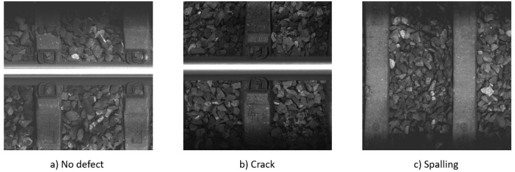
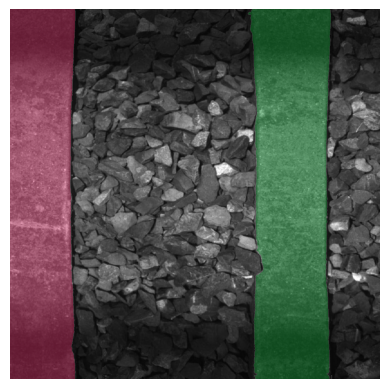
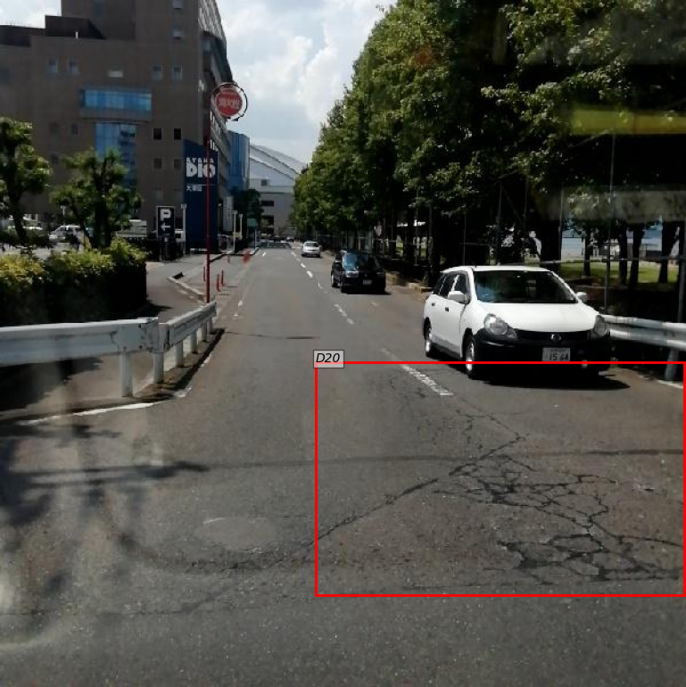
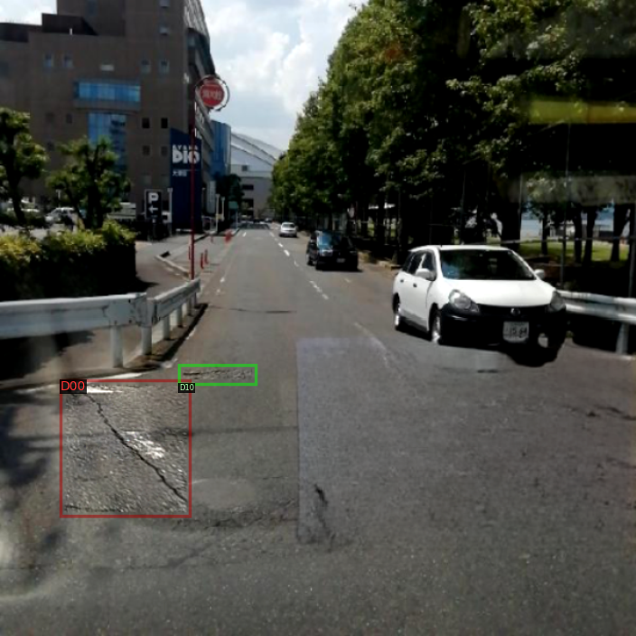
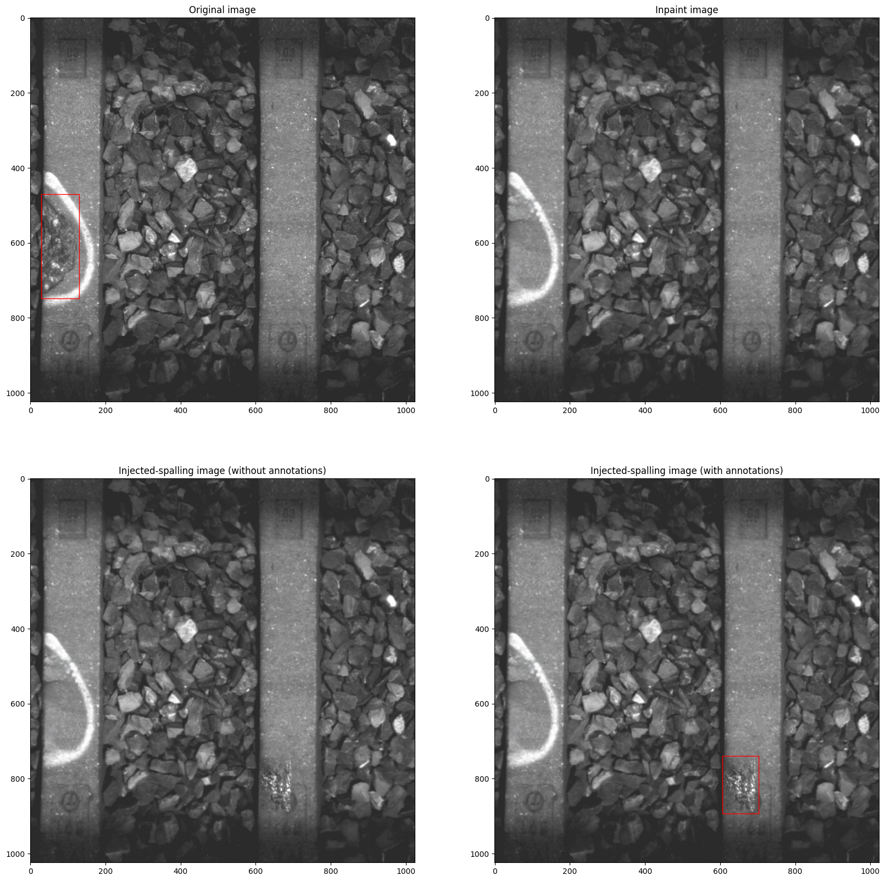
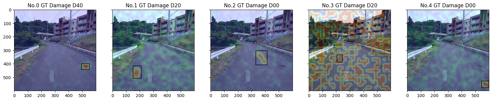
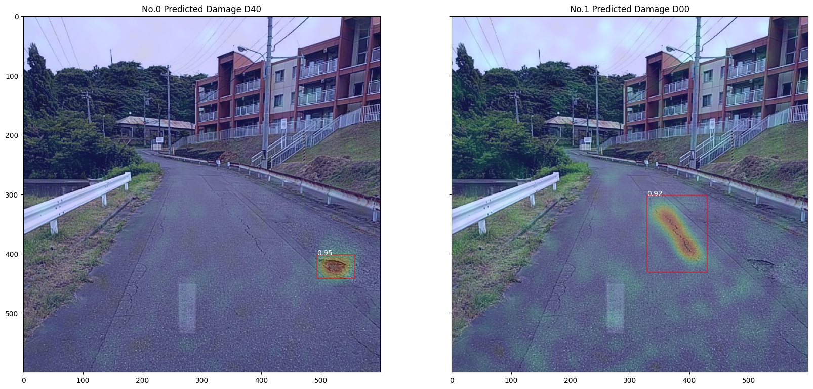

# Master thesis summary
 

This repository is used as a quick summary for my master's thesis. The main purpose is to improve crack detection DL algorithm in road damage detection and railway sleeper crack detection.

Title: Data Augmentations for Improving Vision-Based Damage Detection in Land Transport Infrastructure

Guided by Dr. [Florent Evariste Forest](https://people.epfl.ch/florent.forest/?lang=en)

Supervisor at EPFL, Switzerland: Prof. [Olga Fink](https://people.epfl.ch/olga.fink?lang=en), and co-supervisor at KTH, Sweden: Prof. [Milan Horemuz](https://www.kth.se/profile/horemuz)

For the full thesis, please visit: https://kth.diva-portal.org/smash/record.jsf?pid=diva2:1809735
The ESREL2024 conference version, please visit: https://arxiv.org/abs/2406.18586 
(Note that the results below were from the thesis version, not the conference version) 

## Table of contents

- [Dataset](#Dataset)
- [Road Damage Detection](#Road-damage-detection)
  - [Understanding object detection algorithm](#Understanding-object-detection-algorithm)
  - [Data augmentation](#Data-augmentation)
      - [Perspective-awareness](#Perspective-awareness)
      - [Erasing damage](#Erasing-damage)
  - [Results](#Results)
  - [Analysis](#Analysis)
- [Test on a random video on Youtube](#Testing-on-a-random-video-on-Youtube)
- [Citation](#Citation)

#
## Dataset 
1. Road damage dataset came from [RDDC2020](https://github.com/sekilab/RoadDamageDetector#dataset-for-global-road-damage-detection-challenge-2020). Images are collected from the Czech Republic, India, and Japan (three images below from left to right). The dataset is open to the public. More detail about the dataset can be found in [the link](https://www.sciencedirect.com/science/article/pii/S2352340921004170).

Please note that the dataset didn't come with annotation for the test dataset. The participant have to . Thus, participant have to submit the file in the submission format to the organizer then the organizer will report the result on [their website.](https://crddc2022.sekilab.global/submissions/). The results in this thesis will be report based on evaluation datasets. The partition of the dataset can be seen in dataset_partition.

RDDC2020 have some problems with truncated data and annotations. The problems have been addressed and fixed in RDDC2022. The dataset is available [here](https://figshare.com/articles/dataset/RDD2022_-_The_multi-national_Road_Damage_Dataset_released_through_CRDDC_2022/21431547). The dataset is open to the public. More detail about the dataset can be found in [the link](https://arxiv.org/abs/2209.08538). The reason why this thesis started at RDDC2020 is because the size of the dataset is smaller and easier to work with. In the future, I might work with RDDC2022.

Road damage types in RDDC2020 and RDDC2022
| Order | Annotation | Damage Type |
| :---: | :---: | :---: |
| 0 | D00 | Longitudinal Crack |
| 1 | D10 | Transverse Crack |
| 2 | D20 | Alligator Crack |
| 3 | D40 | Pothole |

2. Sleeper crack dataset came from two sources: acquired from diagnostic locomotives came from the Swiss Federal Railways (SBB), and will be acquired from UAVs came from the Matterhorn Gotthard Railway (MGB) - the late is still on the process of dealing with drone provider. Both are private data. Below is the example images of sleeper defects from SBB (Rombach, 2022).

Compare between road damage and sleeper defect datasets, one can see that sleeper defect data is a lot less challenge than road damage dataset. The reason is that sleeper defect dataset is taken from a fixed perspective in controled environment. Thus, it is less piority than road damage dataset in term of finding improving the base model with data augmentation technique.

#
## Road damage detection
### 1. Understanding object detection algorithm.
To have a better understanding of the object detection algorithm, I have implemented a simple object detection algorithm using [Faster R-CNN](https://arxiv.org/abs/1506.01497) base with [Feature Pyramid Network](https://arxiv.org/abs/1612.03144) as the backbone network provided by [Detectron2](https://github.com/facebookresearch/detectron2/blob/main/MODEL_ZOO.md) following [Pham et al. (2020)](https://ieeexplore.ieee.org/document/9378027). It is common to use pre-trained model as a feature extractor part of the network. Detectron2 provides a lot of pre-trained models. I have used Faster R-CNN with ResNet-101 backbone (R101-FPN) and ResNeXt-101 backbone (X101-FPN), both pre-trained on [COCO dataset](https://cocodataset.org/#home). The model is trained on the road damage dataset. 

### 2. Data augmentation
Data augmentation is a technique to applying damage of other image place it to a background image with transformations and color transfer technique. The purpose is to reduce data imbalance and make the model more robust to the variation of the data. From Pham et al. (2020), horizontal flipping, resizing, and rotation are used. The images look like this: 

The problem is that this augmentation technique is lack realistic, the placing is too random and the model is not robust to the variation of the data. Resulting in slightly worse performance than the original model.

 Therefore, I have tried to implement other data augmentation techniques to improve the performance of the original model.
#### <ins>Road segmentation</ins> 
To improve the location of the synthetic damage, A segmentation model is used to determine a road area or a sleeper area. [Panoptic segmentation model](https://github.com/facebookresearch/detectron2/tree/main/projects/Panoptic-DeepLab) is used for the RDDC dataset and [Segment-anything model](https://github.com/facebookresearch/segment-anything) is used for the sleeper defect dataset. The result is shown below. The results from the segmentation model are shown below.

Segmentation results from a random image on the RDDC dataset.

Segmentation results from a random image on the SBB dataset.

 #### <ins>Perspective-awareness</ins> 
The technique is introduced by [Lis (2020a)](https://arxiv.org/abs/2210.01779). The idea is to consider the apparent size of the obstacles decreases as their distance to the vehicle increases in road obstacle detection applications. To inject synthetic damage into the image in a perspective-aware manner, the augmentation is applied to the image in the following steps: 

1. Determine the perspective map by using the segmentation mask from the previous step. The perspective map is a 2D array with the same size as the image. Each element of the array is the distance from the pixel to the camera.

Now if we plot a ruler onto the original image, the ruler will look like the image below. Note that the interval between the ticks is 3.5 m.

2. After determining  the perspective maps for damages and background image, the damages are randomly placed on the background image. The damages will be placed into the background that has a similar perspective. The place of the damage is random but the size of the damage is according to the scale calculated from the perspective maps of damage and background image. Additionally, to make the injected damage looks more realistic [Poisson blending](https://www.cs.jhu.edu/~misha/Fall07/Papers/Perez03.pdf) is used to blend the damage into the background image. The result is shown below.

 #### <ins>Erasing damage</ins>
This technique is purposed by [Lis (2020b)](https://arxiv.org/abs/2012.13633) who used this technique to make to model recognize the drivable road path for autonomous  vehicles and [F. Kluger et al (2018)](https://ieeexplore.ieee.org/document/8622318) use the CycleGAN model to train on removed-damage images and added-generated-damage images. However, in this study, I will only focus on erasing damage, either erase it completely or partially. The erasing process can be used by any inpainting model, in this study I used [MAT: Mask-Aware Transformer for Large Hole Image Inpainting
](https://arxiv.org/pdf/2203.15270.pdf), follow the code [MAT's Github](https://github.com/fenglinglwb/MAT.git).

 #### <ins>Erasing damage and augment perspective-aware damage</ins>
This technique is the combination of both erasing and perspective-awareness. The goal of this augmentation technique is to reduce false positives and data imbalance. The results of the data augmentation techniques are shown below.

The augmentation results on the RDDC dataset. (left: before the augmentation, right: after the augmentation)

The augmentation results on the SBB dataset.

### 3. Results
 #### <ins>Road damage dataset</ins>
 The results are shown below from the test dataset (partition from the training dataset) since no annotation is provided for the test dataset.
 
-> Testing results from RDDC dataset on Japan
| Model | Precision | Recall | F1 score | Converge iteration | Score threshold | 
| --- | --- | --- | --- | --- | --- | 
| X101-FPN | 0.515 | 0.445 | 0.483 | 120 000 | 0.56 |
| + RandomAug | 0.504 | 0.442 | 0.473 | 125 000 | 0.51 |
| + RS + InjectPa | 0.496 | 0.442 | 0.471 | 145 000 | 0.51 |
| + Erase + RS + InjectPa | <strong>0.646</strong>  | <strong>0.466</strong>  | <strong>0.541</strong>  | 150 000 | <strong>0.61</strong>  |

-> Testing results from RDDC dataset on Czech and India

| Model | Precision | Recall | F1 score | Converge iteration | Score threshold | 
| --- | --- | --- | --- | --- | --- | 
| <ins>Czech<ins> |
| X101-FPN | 0.532 | 0.458 | 0.514 | 75 000 |0.81 |
| + Erase + RS + InjectPa  | 0.563 | 0.447 | 0.512 | 65 000 | 0.75 |
| <ins>India</ins> |
| X101-FPN | 0.612  | 0.462 | 0.542 | 95 000 | 0.80 |
| + Erase + RS + InjectPa  | 0.566 | 0.490 | 0.525 | 115 000 | 0.56 |

-> Testing results from RDDC dataset on three countrie
| Model | Precision | Recall | F1 score | Converge iteration | Score threshold | 
| --- | --- | --- | --- | --- | --- | 
| R101-FPN | 0.55 | 0.51 | 0.53 | 115 000 | 0.57 |
| X101-FPN | 0.60 | 0.50 | <strong>0.55</strong> | <strong>95 000</strong> | 0.59 | 
| + RandomAug | 0.61 | 0.48 | 0.54 | 125 000 | 0.62 |
| + RS | 0.61 | 0.46 | 0.53 | 120 000 | 0.56 |
| + RS + InjectPa | 0.51 | 0.49 | 0.50 | 130 000 | 0.53 |
| + Erase | 0.59 | 0.49 | 0.54 | 120 000 | 0.59 |
| + Erase + RS + InjectPa | 0.52 | 0.43 | 0.47 | 155 000 | 0.55 |

Note:
* RandomAug implies randomly sampling and injecting damage
* RS stands for Road Segmentation
* InjectPa stands for injecting perspective-aware damage

 #### <ins>Sleeper defect dataset</ins>
 The results show below from evaluation dataset (during inference).
| Model | F1 score | AP50 | Converge iteration | Time (hr) | 
| --- | --- | --- | --- | --- |
| R50-FPN | <strong>0.767</strong> | 75.40 | 40 000 | 2 |
| + SAM + Erase + Inject | 0.750 | <ins>80.05</ins> | 60 000 | 12 |
| R50-FPN-fr50 |  0.623 | 65.72 | 72 000 | 3.5 |
| + SAM + Erase + Inject | 0.624 | 63.93 | 98 000 | 25 |
| X101-FPN | 0.750 | 75.13 | 35 000 | 4 | 
| + SAM + Erase + Inject | 0.751 | 75.15 | 63 000 | 18 |

Note: the results came from one training on the same seed. More trainings on different seed are needed to validate the results if time avialable. 

#
### 4. Analysis
The performance of the augmentation tachnique could only improve the model that trained on images from Japan from the RDDC dataset with Erase + RS + InjectPa. But it does not improve the base model when trained on Czech, India or all countires simontaniously. 

On the other hand, when trains the model on the SBB dataset. The same augmentation tecnique does not improve F1 score but rather improve AP50 and validation loss of the model (the validation loss isn't shown here).

Finally, the theis experiments the explainable AI (XAI) by using [D-RISE](https://arxiv.org/abs/2006.03204). The XAI helps exploring the model into a deeper level by providing saliency map from the model's prediction. 

#### <ins>X101-FPN + Erase + RS + InjectPa model</ins>
First, ground truth is used as the target prediction. The results show that the model trained with the augmentation cannot damage no.3 class D20 even though ground truth is shown in the model. Notice that the model focuses on pixels outside the bounding box. It means that the quality of the bounding box is not good enough for the model to learn, or the model is not precise enough.

Then, the model's prediction is used as the target prediction. The results shows that the model focus on the features of the damage on the road accurately. 

#
## Testing on a random video on Youtube
Note that the label show class labels; 0 to 3 and its predicted score. So 0 98% means class label 0 with 98% predicted score. The score threshold is 0.70. [Download here](images/x101_120_000.mp4)

[source at 2.23 mins](https://www.youtube.com/watch?v=JzyRESNfhxo&t=977s) 

#
## Citation
Pham, V., Pham, C., & Dang, T. (2020). Road Damage Detection and Classification with Detectron2 and Faster R-CNN. https://doi.org/10.1109/bigdata50022.2020.9378027

Lis, K. (2022, October 4). Perspective Aware Road Obstacle Detection. arXiv.org. https://arxiv.org/abs/2210.01779

Lis, K. (2020, December 25). Detecting Road Obstacles by Erasing Them. arXiv.org. https://arxiv.org/abs/2012.13633

F. Kluger et al., "Region-based Cycle-Consistent Data Augmentation for Object Detection," 2018 IEEE International Conference on Big Data (Big Data), Seattle, WA, USA, 2018, pp. 5205-5211, doi: 10.1109/BigData.2018.8622318.

Rombach, K. (2022, August 28). Contrastive feature learning for fault detection and diagnostics in railway applications. arXiv.org. https://arxiv.org/abs/2208.13288
