# Master thesis progress report
 

This repository is used as a tracker for my master's thesis which I am currently working on.
The main purpose is to improve crack detection DL algorithm in road damage detection and railway sleeper crack detection.

Guided by dr. [Florent Evariste Forest](https://people.epfl.ch/florent.forest/?lang=en), supervisor at EPFL, Switzerland: prof. [Olga Fink](https://people.epfl.ch/olga.fink?lang=en), and co-supervisor at KTH, Sweden: prof. [Milan Horemuz](https://www.kth.se/profile/horemuz)

## Table of contents

- [Dataset](#Dataset)
- [Road Damage Detection](#Road-damage-detection)
  - [Understanding object detection algorithm](#Understanding-object-detection-algorithm)
  - [Data augmentation](#Data-augmentation)
      - [Perspective-awareness](#Perspective-awareness)
      - [Erasing damage](#Erasing-damage)
  - [Results](#Results)
  - [Analysis](#Analysis)

- [Citation](#Citation)

#
## Dataset 
1. Road damage dataset came from [RDDC2020](https://github.com/sekilab/RoadDamageDetector#dataset-for-global-road-damage-detection-challenge-2020). Images are collected from the Czech Republic, India, and Japan (three images below from left to right). The dataset is open to the public. More detail about the dataset can be found in [the link](https://www.sciencedirect.com/science/article/pii/S2352340921004170).

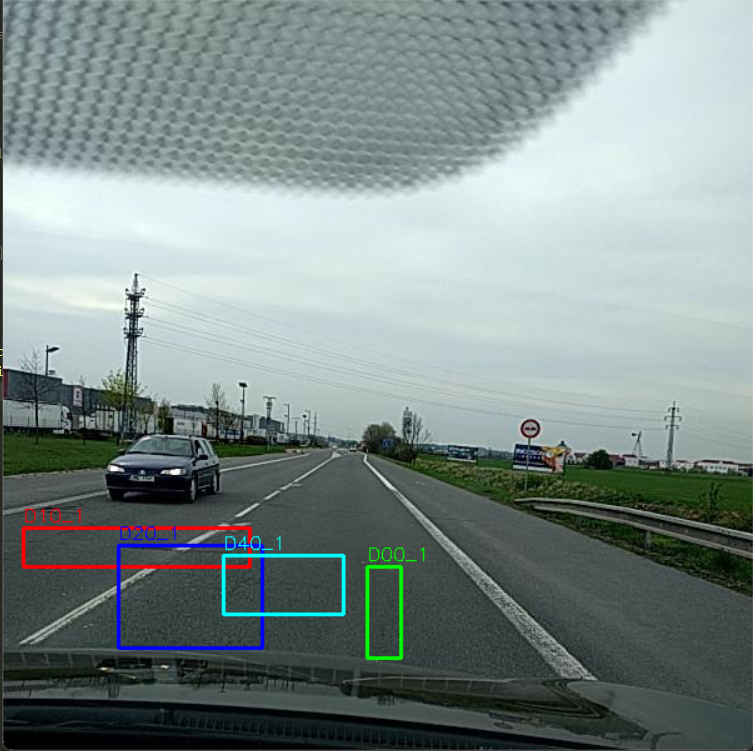
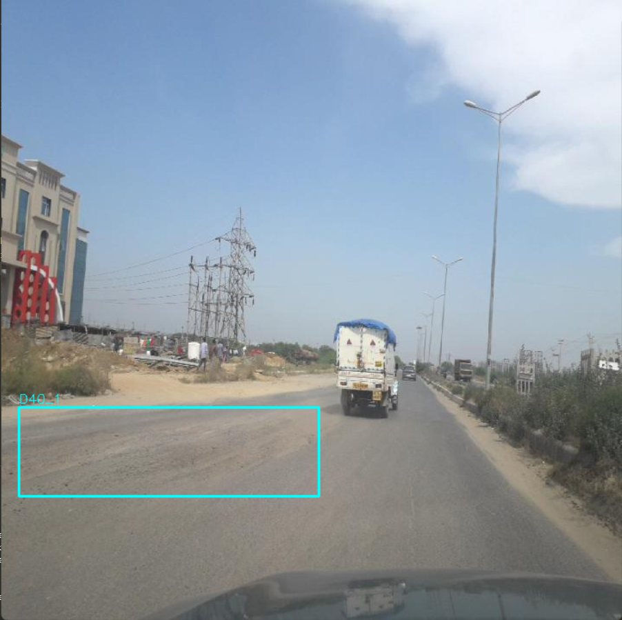
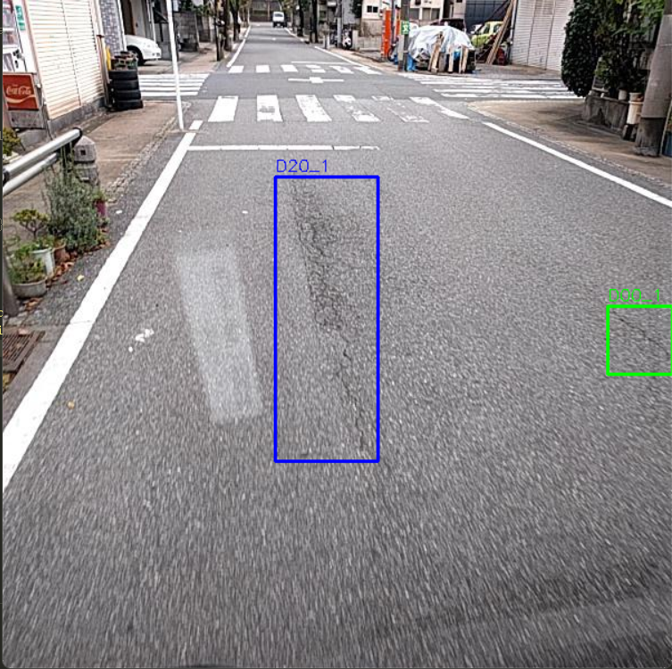

Please note that the dataset didn't come with annotation for the test dataset. The participant have to . Thus, participant have to submit the file in the submission format to the organizer then the organizer will report the result on [their website.](https://crddc2022.sekilab.global/submissions/). The results in this thesis will be report based on evaluation datasets. The partition of the dataset can be seen in dataset_partition.

RDDC2020 have some problems with truncated data and annotations. The problems have been addressed and fixed in RDDC2022. The dataset is available [here](https://figshare.com/articles/dataset/RDD2022_-_The_multi-national_Road_Damage_Dataset_released_through_CRDDC_2022/21431547). The dataset is open to the public. More detail about the dataset can be found in [the link](https://arxiv.org/abs/2209.08538). The reason why this thesis started at RDDC2020 is because the size of the dataset is smaller and easier to work with. In the future, I might work with RDDC2022.

Road damage types in RDDC2020 and RDDC2022
| Order | Annotation | Damage Type |
| :---: | :---: | :---: |
| 0 | D00 | Longitudinal Crack |
| 1 | D10 | Transverse Crack |
| 2 | D20 | Alligator Crack |
| 3 | D40 | Pothole |

2. Sleeper crack dataset acquired from diagnostic locomotives came from the Swiss Federal Railways (SBB), and acquired from UAVs came from the Matterhorn Gotthard Railway (MGB). Both are private data.
#
## Road damage detection
### 1. Understanding object detection algorithm.
To have a better understanding of the object detection algorithm, I have implemented a simple object detection algorithm using [Faster R-CNN](https://arxiv.org/abs/1506.01497) base with [Feature Pyramid Network](https://arxiv.org/abs/1612.03144) as the backbone network provided by [Detectron2](https://github.com/facebookresearch/detectron2/blob/main/MODEL_ZOO.md) following [Pham et al. (2020)](https://ieeexplore.ieee.org/document/9378027). It is common to use pre-trained model as a feature extractor part of the network. Detectron2 provides a lot of pre-trained models. I have used Faster R-CNN with ResNet-101 backbone (R101-FPN) and ResNeXt-101 backbone (X101-FPN), both pre-trained on [COCO dataset](https://cocodataset.org/#home). The model is trained on the road damage dataset. 

### 2. Data augmentation
Data augmentation is a technique to increase the size of the dataset by applying some transformations to the original images. The purpose is to make the model more robust to the variation of the data. From Pham et al. (2020), horizontal flipping, resizing, and rotation are used. The images look like this: 

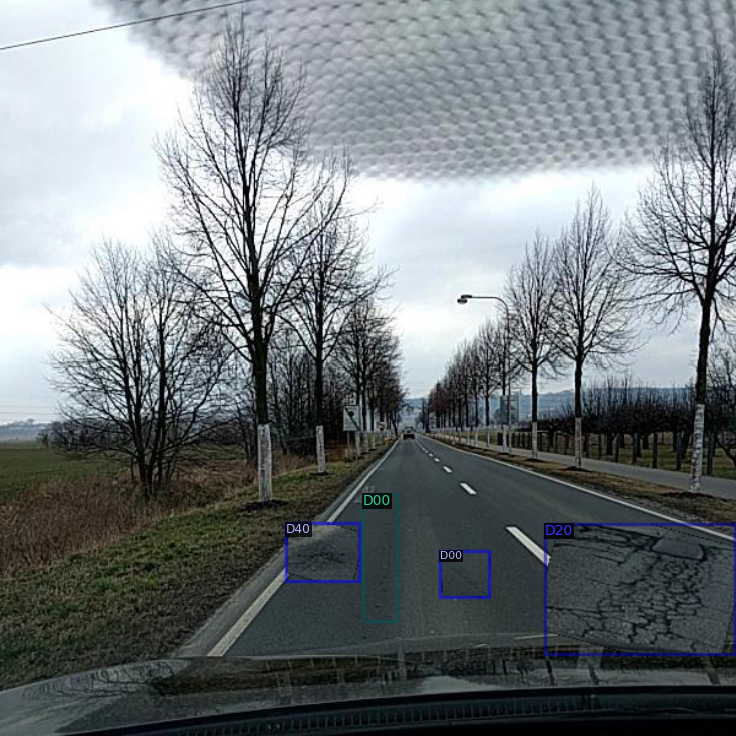
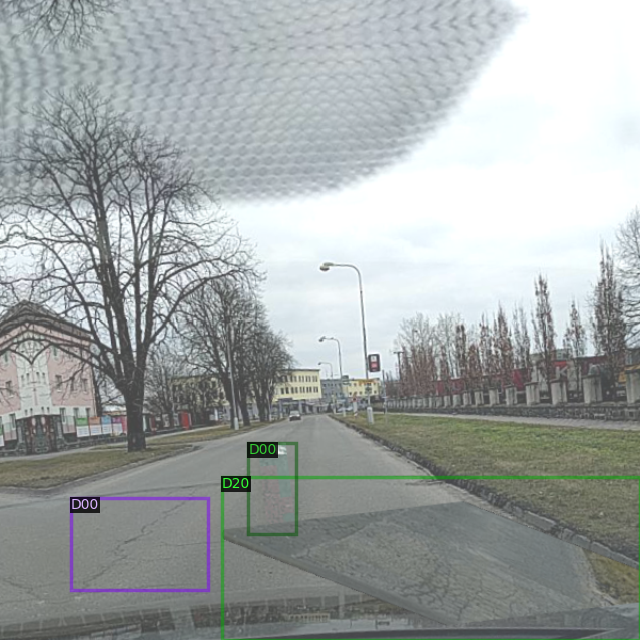
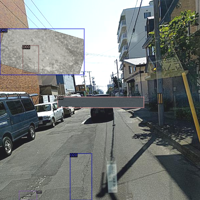

The problem is that this augmentation technique is lack realistic, the placing is too random and the model is not robust to the variation of the data. Resulting in slightly worse performance than the original model.

 Therefore, I have tried to implement other data augmentation techniques to improve the performance of the original model.
 #### <ins>Perspective-awareness</ins> 
The technique is introduced by [Lis (2020a)](https://arxiv.org/abs/2210.01779). The idea is to consider the apparent size of the obstacles decreases as their distance to the vehicle increases in road obstacle detection applications. To inject synthetic damage into the image in a perspective-aware manner, the augmentation is applied to the image in the following steps: 
1. Use any pre-trained segmentation model to segment the road surface from the image. For this project, Panoptic FPN with ResNet-101 backbone pre-trained on the COCO dataset is used.

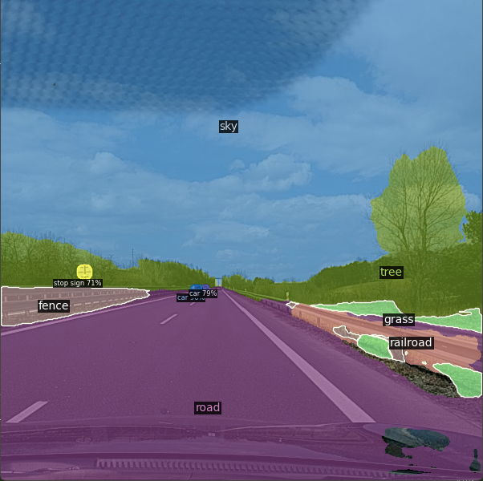

2. Determine the perspective map by using the segmentation mask from the previous step. The perspective map is a 2D array with the same size as the image. Each element of the array is the distance from the pixel to the camera.

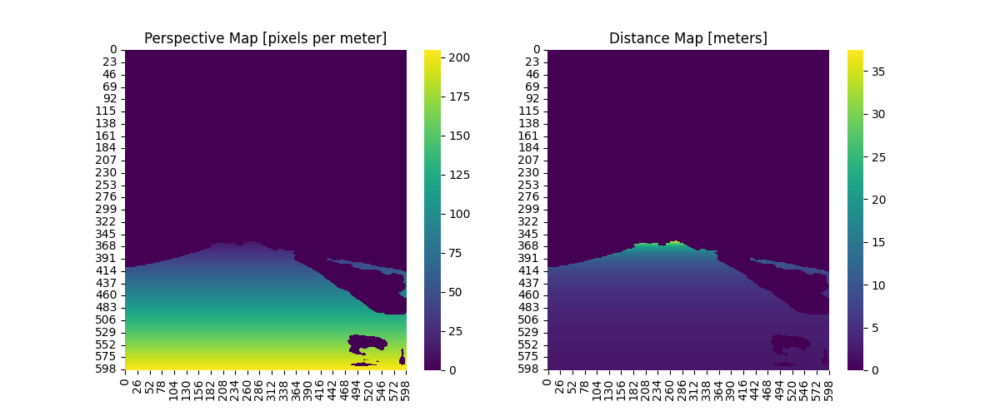

Now if we plot a ruler onto the original image, the ruler will look like the image below. Note that the interval between the ticks is 3.5 m.

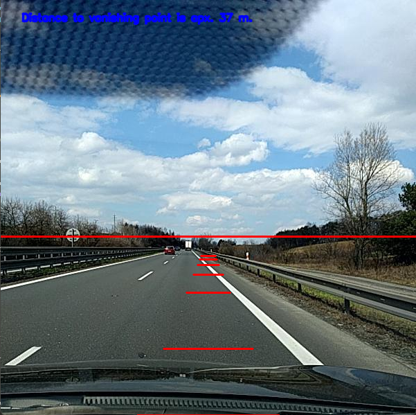

3. After determining  the perspective maps for damages and background image, the damages are randomly placed on the background image. The damages will be placed into the background that has a similar perspective. The place of the damage is random but the size of the damage is according to the scale calculated from the perspective maps of damage and background image. Additionally, to make the injected damage looks more realistic [Poisson blending](https://www.cs.jhu.edu/~misha/Fall07/Papers/Perez03.pdf) is used to blend the damage into the background image. The result is shown below.

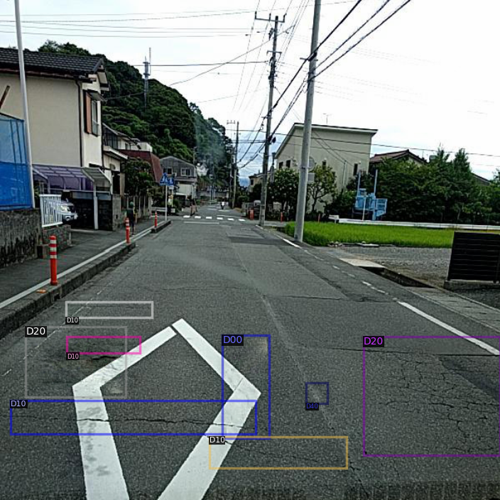
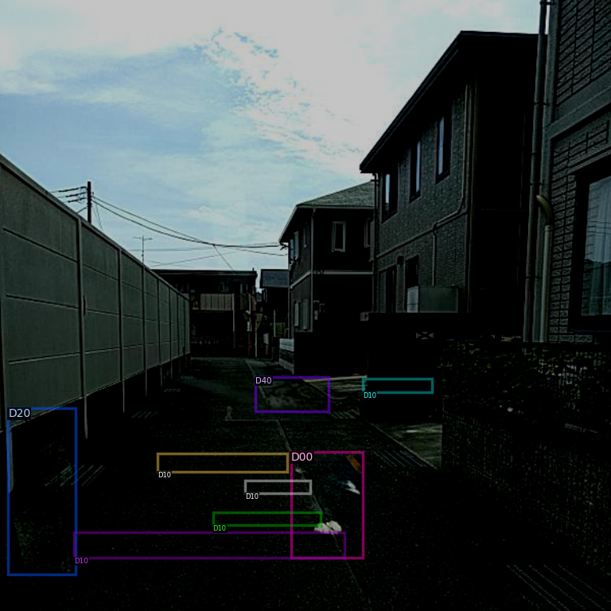
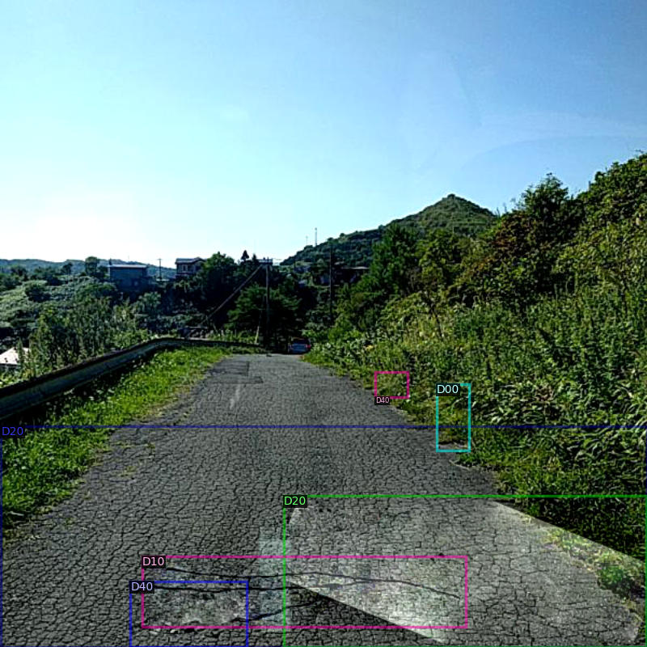

 #### <ins>Erasing damage</ins>
This technique is purposed by [Lis (2020b)](https://arxiv.org/abs/2012.13633) who used this technique to make to model recognize the drivable road path for autonomous  vehicles and [F. Kluger et al (2018)](https://ieeexplore.ieee.org/document/8622318) use the CycleGAN model to train on removed-damage images and added-generated-damage images. However, in this study, I will only focus on erasing damage, either erase it completely or partially. The erasing process can be used by any inpainting model, in this study I used [MAT: Mask-Aware Transformer for Large Hole Image Inpainting
](https://arxiv.org/pdf/2203.15270.pdf), follow the code [MAT's Github](https://github.com/fenglinglwb/MAT.git).

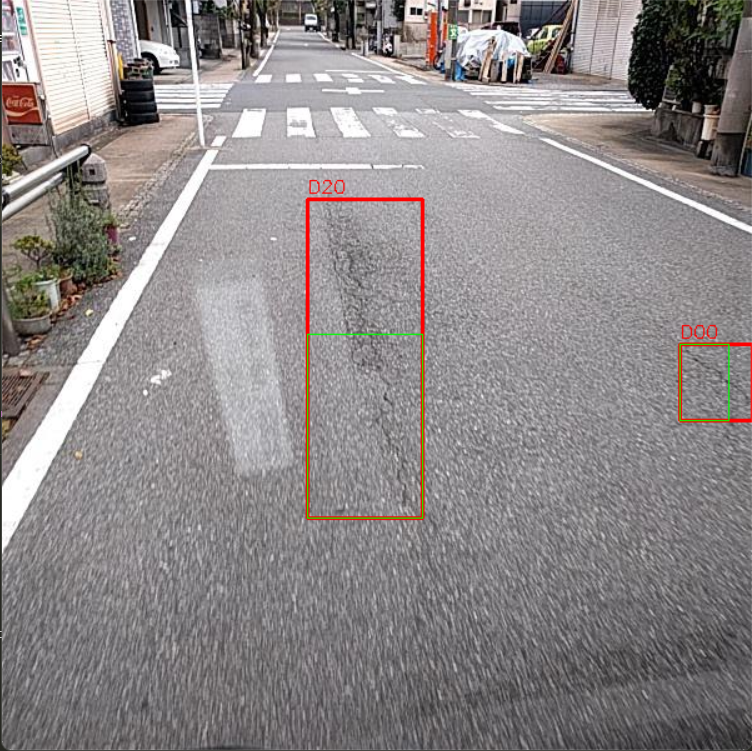
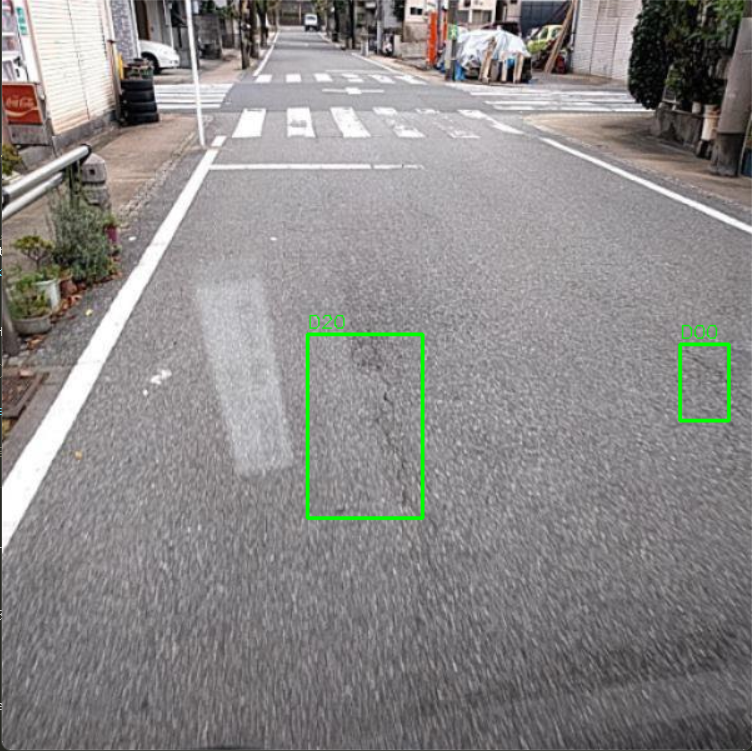
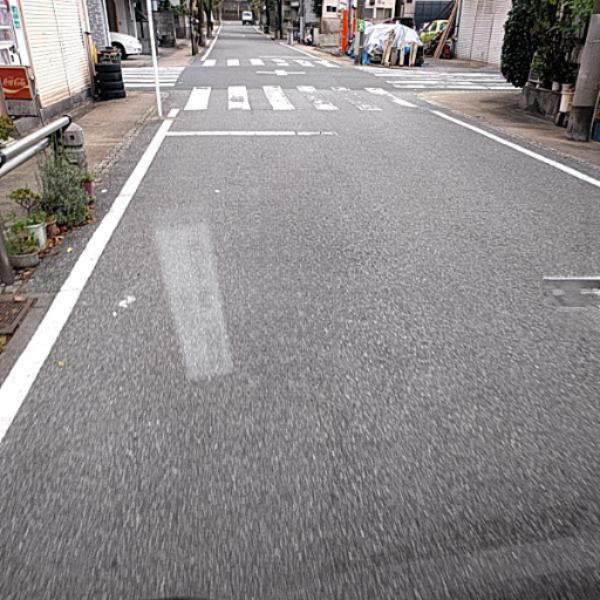

#
### 3. Results
| Model | Precision | Recall | F1 score | Converge iteration | Score threshold | 
| --- | --- | --- | --- | --- | --- | 
| R101-FPN | 0.55 | 0.51 | 0.53 | 115 000 | 0.57 |
| X101-FPN | 0.60 | 0.50 | 0.55 | 95 000 | 0.59 | 
| X101-FPN + Augmentation | 0.61 | 0.48 | 0.54 | 125 000 | 0.62 |
| X101-FPN + Road Segment | 0.61 | 0.46 | 0.53 | 120 000 | 0.56 |
| X101-FPN + Perspective-awareness | 0.51 | 0.49 | 0.50 | 130 000 | 0.53 |
| X101-FPN + Erasing damage | 0.59 | 0.49 | 0.54 | 120 000 | 0.59 |
| X101-FPN + Aug + Ed |  |  |  | | |
| X101-FPN + Pa + Ed |  |  |  | | |

Note: the results came from one training on the same seed. More trainings on different seed are needed to validate the results. 

#
### 4. Analysis
On the left side visualizations of each model show output feature maps from the FPN. P2 denote the first feature map and the others follow the same analogous to P6 which is the last feature map. Thus, P6 has larger perceptive field than P2. On the right is the visualization of objectness map (the title in the images are incorrectly). The objectness_logit maps (the predicted objectness logits for all anchors) are applied Sigmoid functioon to get the objectness map. It is importance to recall that all feature map and its objectness map contribute to the final prediction. JET color map is used on both visualizations; the red color represents higher values where the blue color represent smaller values. 

In general, the model can detect the near damages on the road where are obvious to human eye i.e. the pothole damage (D40 for ground truth and class 3 for the prediction box). Additionally, the perspective-aware model can detect a further damage than the other models but it misclassified it. Even more, the larger perceptive field of the model (P4 to P6) started to distinguish the road surface better than the other models.

Note that this is just a visualization from feature map of the model, it doesn't give the same meaning as the like of explainable AI such as [D-RISE](https://arxiv.org/abs/2006.03204). 

<!-- #### <ins>R101-FPN model</ins>

 -->

#### <ins>X101-FPN model</ins>

<!-- 
#### <ins>X101-FPN augmentation model</ins>

#### <ins>X101-FPN road segmentation model</ins>

 -->

#### <ins>Perspective-aware</ins>

#### <ins>Erasing Damage</ins>

#
## Testing on a random video on Youtube
Note that the label show class labels; 0 to 3 and its predicted score. So 0 98% means class label 0 with 98% predicted score. The score threshold is 0.70. [Download](images\x101_120_000_EDIT.mp4)

[source at 2.23](https://www.youtube.com/watch?v=JzyRESNfhxo&t=977s) 

#
## Citation
Pham, V., Pham, C., & Dang, T. (2020). Road Damage Detection and Classification with Detectron2 and Faster R-CNN. https://doi.org/10.1109/bigdata50022.2020.9378027

Lis, K. (2022, October 4). Perspective Aware Road Obstacle Detection. arXiv.org. https://arxiv.org/abs/2210.01779

Lis, K. (2020, December 25). Detecting Road Obstacles by Erasing Them. arXiv.org. https://arxiv.org/abs/2012.13633

F. Kluger et al., "Region-based Cycle-Consistent Data Augmentation for Object Detection," 2018 IEEE International Conference on Big Data (Big Data), Seattle, WA, USA, 2018, pp. 5205-5211, doi: 10.1109/BigData.2018.8622318.

#
## Note 
Given the time constraint, I only used Faster R-CNN with ResNet+FPN backbone.
There are many other models with different architecture and backbone that have been used in the RDDC like [YOLOv5](https://ieeexplore.ieee.org/document/9377833), [Cascade R-CNN](https://arxiv.org/pdf/1712.00726.pdf), and even [Swin Transformer](https://arxiv.org/abs/2211.11362) (the winner of RDDC2022).